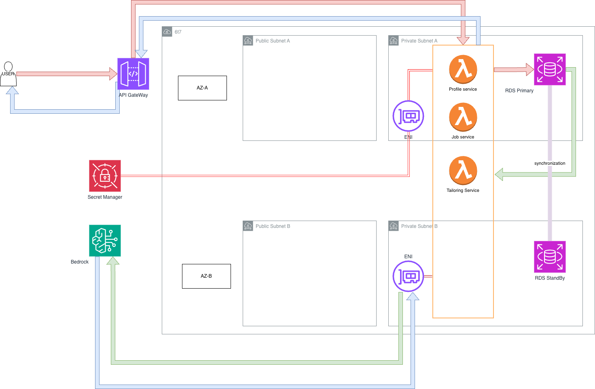
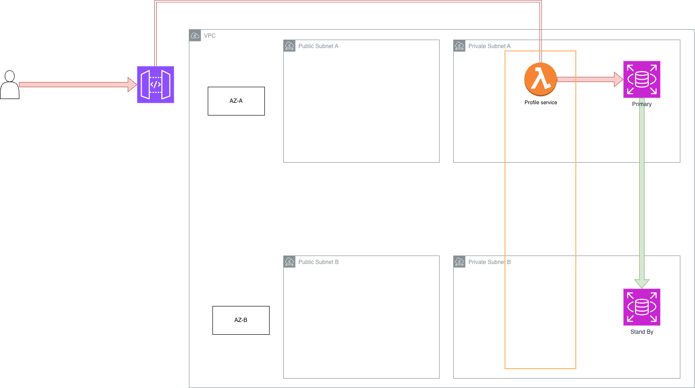
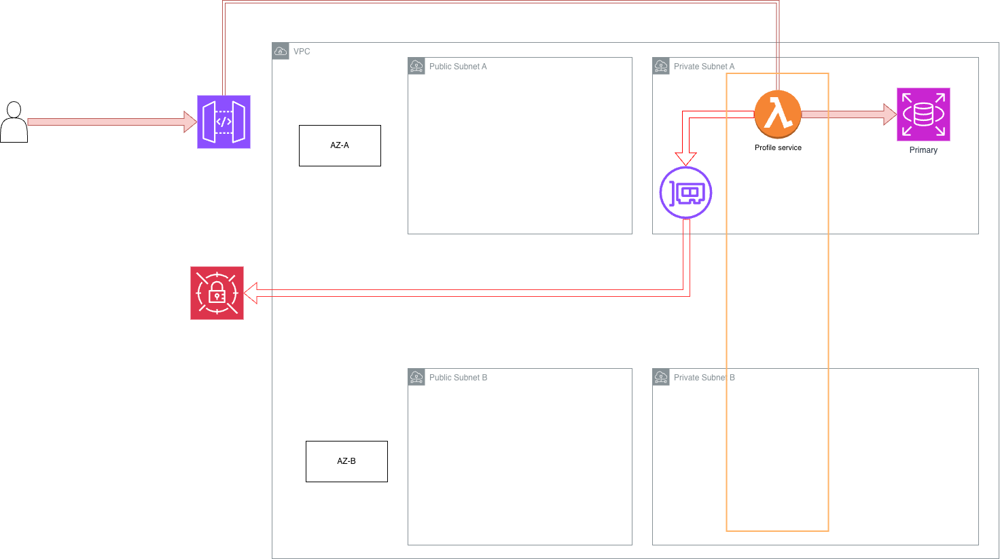

# AI-Powered Job Application Tailoring Platform

An intelligent web application that helps job seekers generate tailored CVs and cover letters for specific roles using their stored experience, projects, skills, and certifications.

Instead of rewriting application documents from scratch for every job, users enter their background once into the platform. The app then analyzes a job description, matches the most relevant experience from the database, and generates customized application materials grounded in the user’s real information.


---

## Problem

Applying for jobs is repetitive and time-consuming.

Most candidates need to:

- rewrite the same experience for different roles

- adjust CVs to match job descriptions

- create new cover letters for each company

- keep track of which application version was sent where

This process is especially painful for students, graduates, and early-career tech professionals who may be applying to many roles at once.

---

## Solution

To create an AI-powered career document generation system that uses structured user experience data to produce customized, role-specific application materials.

---

## Architecture Diagram


---

## Core Features

### MVP Features


- User profile creation and editing

- Structured storage for:

  - personal summary

  - education

  - work experience

  - technical skills

  - projects

  - certifications

- Job description input

- AI-powered job requirement extraction

- Relevance matching between job description and user profile

- Tailored CV generation

- Tailored cover letter generation

- Export generated documents




1. Profile service Lambda
   1. Create user profile
   2. update profile
   3. Read and write to RDS
2. Job tailoring Lambda
   1. receive job description
   2. fetch user profile form DB
   3. call Bedrock
   4. CV/Cover letter generate
   5. return result

#### Step-1: Fundation setup with CDK
Use CDK to create apigateway and lambda LaC then test it

- remember dont delete the S3 bucket made form the bootstrap otherwise u need to delete the CDKToolkit stack and bootstrap again

```
> curl -X PUT "https://kbmowaael3.execute-api.us-east-1.amazonaws.com/profile"
{"message": "Profile service API is running"}%  
```
this show that the apigateway and lambda is successfully running!

- i have done some update for the stack code, so now the lambda code is not use 
Code.formInline but Code.fromAsset, and it turn out that the cloudformation will put the lambda in the zip and in a default bucket

```
ProfileServiceHandler4430D52F:
    Type: AWS::Lambda::Function
    Properties:
      Code:
        S3Bucket:
          Fn::Sub: cdk-hnb659fds-assets-${AWS::AccountId}-${AWS::Region}
        S3Key: d0ec76d1f190c9fdca3600e82a628d9b7eabbee7ca98041fa28f10fe43b79ddb.zip
      Handler: index.handler
```
- alright i make the lambda took json data and echo back

```
curl -X PUT "https://kbmowaael3.execute-api.us-east-1.amazonaws.com/profile" \
  -H "Content-Type: application/json" \
  -d '{
    "full_name": "Allan Chien",
    "email": "allan@example.com",
    "skills": ["AWS", "Python", "Docker"],
    "projects": [
      {
        "name": "Stock Market Real-Time Data Analytics Pipeline on AWS"
      }
    ]
  }'
{"message": "Profile received successfully", "received_profile": {"full_name": "Allan Chien", "email": "allan@example.com", "skills": ["AWS", "Python", "Docker"], "projects": [{"name": "Stock Market Real-Time Data Analytics Pipeline on AWS"}]}}%   
```
#### Step-2: RDS implement


Implement the architecture using CDK
##### 2.1: Implemment lambda profile service backend logic

 Now the Python code should move from echo test handler to real profile-service backend logic.

- remember to install necessary package for example 
```
import psycopg
```
with 
```
cd infra/lambda/profile-service
pip install --target . 'psycopg[binary]'
```

this is because  AWS Lambda does not come with psycopg preinstalled.

- okay lambda funcion erro form cloudwatch log, this is probally issue with psycopg
```
[ERROR] Runtime.ImportModuleError: Unable to import module 'index': no pq wrapper available.
Attempts made:
- couldn't import psycopg 'c' implementation: No module named 'psycopg_c'
- couldn't import psycopg 'binary' implementation: cannot import name 'pq' from 'psycopg_binary' (/var/task/psycopg_binary/__init__.py)
- couldn't import psycopg 'python' implementation: libpq library not found
Traceback (most recent call last):
```
need to fix it

now I have try 
```
import pg8000
```
but I think the problem is Lambda cannot reach Secrets Manager from the isolated subnet, so i probally need a redesign of the architecture



so use an enterface endpoint to connect the instances in the private subnet to the public aws service

```
> curl -X PUT "https://kbmowaael3.execute-api.us-east-1.amazonaws.com/profile" \
  -H "Content-Type: application/json" \
  -d '{
    "full_name": "Allan Chien",
    "email": "allan@example.com",
    "skills": ["AWS", "Python", "Docker"]
  }'

{"message": "Profile saved successfully", "profile_id": 1, "email": "allan@example.com"}%                                                                             
```
ok now the implemntion is good
Now i need to find a way to connet to the RDS to verify data table 
so i have sucessfully add a GET endpoint and verify data in RDS
```
> curl "https://kbmowaael3.execute-api.us-east-1.amazonaws.com/profile?email=allan@example.com"
{"profile_id": 1, "email": "allan@example.com", "full_name": "Allan Chien", "profile_data": {"email": "allan@example.com", "skills": ["AWS", "Python", "Docker"], "full_name": "Allan Chien"}}%                                 
```

##### 2.2: Add job description endpoint
```
> curl -X PUT "https://kbmowaael3.execute-api.us-east-1.amazonaws.com/job-description" \
  -H "Content-Type: application/json" \
  -d '{
    "company_name": "Catalyst Cloud",
    "job_title": "Junior DevOps Engineer",
    "raw_description": "We are looking for someone with AWS, Linux, CI/CD..."
  }'
{"message": "Job description saved successfully", "job_id": 1, "company_name": "Catalyst Cloud", "job_title": "Junior DevOps Engineer"}%   

 curl "https://kbmowaael3.execute-api.us-east-1.amazonaws.com/job-description?job_id=1"
{"job_id": 1, "company_name": "Catalyst Cloud", "job_title": "Junior DevOps Engineer", "raw_description": "We are looking for someone with AWS, Linux, CI/CD..."}%     
```


#### Step-3: AI service implemet 
##### 3.1: Add tailoring Lambda
1. get email and job_id
2. read profile row
3. read job description row
4. extract requirements from raw_description
5. score profile skills/projects
6. return matched context

```
curl -X POST "https://kbmowaael3.execute-api.us-east-1.amazonaws.com/tailor-preview" \
  -H "Content-Type: application/json" \
  -d '{
    "email": "allan@example.com",
    "job_id": 1
  }'
{"message": "Tailor preview data loaded successfully", "email": "allan@example.com", "job_id": 1, "profile": {"profile_id": 1, "email": "allan@example.com", "full_name": "Allan Chien", "profile_data": {"email": "allan@example.com", "skills": ["AWS", "Python", "Docker"], "full_name": "Allan Chien"}}, "job_description": {"job_id": 1, "company_name": "Catalyst Cloud", "job_title": "Junior DevOps Engineer", "raw_description": "We are looking for someone with AWS, Linux, CI/CD..."}, "extracted_requirements": ["aws", "linux", "ci/cd"]}%                                                                                                
```
now i need ot do 5. and 6.

```
 curl -X POST "https://kbmowaael3.execute-api.us-east-1.amazonaws.com/tailor-preview" \
  -H "Content-Type: application/json" \
  -d '{
    "email": "allan@example.com",
    "job_id": 1
  }'
{"message": "Tailor preview data loaded successfully", "email": "allan@example.com", "job_id": 1, "profile": {"profile_id": 1, "email": "allan@example.com", "full_name": "Allan Chien", "profile_data": {"email": "allan@example.com", "skills": ["AWS", "Python", "Docker"], "projects": [{"name": "2048 CI/CD Project", "description": "Built a CI/CD pipeline using AWS CodePipeline, ECS, and ECR."}], "full_name": "Allan Chien", "experience": [{"title": "Research Engineer", "description": "Worked on Bittide protocol implementation."}]}}, "job_description": {"job_id": 1, "company_name": "Catalyst Cloud", "job_title": "Junior DevOps Engineer", "raw_description": "We are looking for someone with AWS, Linux, CI/CD..."}, "extracted_requirements": ["aws", "linux", "ci/cd"], "matched_skills": ["aws"], "matched_projects": [{"name": "2048 CI/CD Project", "description": "Built a CI/CD pipeline using AWS CodePipeline, ECS, and ECR.", "score": 10, "matched_terms": ["ci/cd", "aws"]}], "matched_experiences": [], "prompt_context": {"candidate": {"full_name": "Allan Chien", "email": "allan@example.com"}, "target_role": {"company_name": "Catalyst Cloud", "job_title": "Junior DevOps Engineer"}, "job_requirements": ["aws", "linux", "ci/cd"], "matched_skills": ["aws"], "matched_projects": [{"name": "2048 CI/CD Project", "description": "Built a CI/CD pipeline using AWS CodePipeline, ECS, and ECR.", "score": 10, "matched_terms": ["ci/cd", "aws"]}], "matched_experiences": []}}%                
```


---

## Phase 2

Phase 2 shifted focus from backend services to a real frontend, plus a persistence layer for the documents the frontend creates.

#### Step-4: CV Dashboard (React + Vite)

Built a `dashboard/` app (React, TypeScript, Vite) on a separate `PDF-Dashboard` branch, in parallel with the Step-3 tailoring work on `main`:

- `LoginPage`, `MyCVsPage`, `CVBuilderPage` — pages for signing in, listing saved CVs, and editing one
- `CVEditor` + `ModernTemplate` — structured CV editing with a rendered preview template
- `exportPDF` util — client-side export of the rendered CV to PDF
- `useCVStore` — app state (Zustand-style store) shared across the builder
- `AISidebar` — panel of AI tool cards (job alignment, readability, ATS check, cover letter draft, etc.); currently UI-only placeholders ("Coming soon") not yet wired to the tailoring-service or Bedrock

#### Step-5: CV persistence service

Added a fourth Lambda, `cv-service`, so the dashboard has somewhere to save/load CVs:

- `PUT /cv` — create or update a CV (`cv_data` stored as `JSONB`, keyed by `email`)
- `GET /cv` — fetch one CV by `cv_id` + `email`
- `GET /cv/list` — list a user's non-archived CVs, most recently updated first
- `DELETE /cv` — soft-delete (`is_archived = TRUE`) rather than hard delete

Same RDS instance and Secrets Manager access pattern as `profile-service`.

#### Step-6: Merge frontend and backend

- Wired the dashboard's `api/cvApi.ts` calls to the deployed `cv-service` endpoints and cleaned out files that had been accidentally committed
- Merged `PDF-Dashboard` into `main` (PR #1), bringing the dashboard and all four backend services (`profile-service`, `job-service`, `tailoring-service`, `cv-service`) together for the first time

### Current status

- Working end-to-end: profile creation → job description capture → requirement extraction and skill/project matching (`tailoring-service`) → CV building and persistence in the dashboard
- Not yet connected: the dashboard's `AISidebar` and job-alignment tools are still placeholders — they don't call `tailoring-service` yet, and there's no Bedrock-generated CV/cover-letter text produced from `prompt_context`
- Next up: wire the dashboard to `tailoring-service`, and add the Bedrock call that turns `prompt_context` into actual tailored CV/cover letter copy 