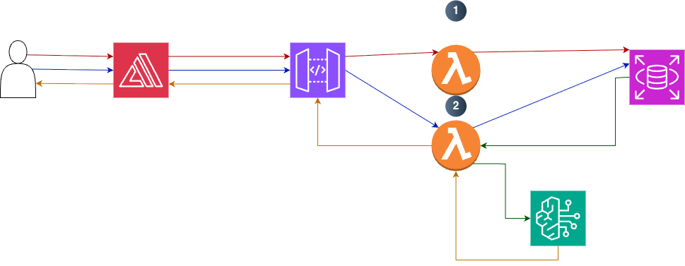

# AI-Powered Job Application Tailoring Platform

An intelligent web application that helps job seekers generate tailored CVs and cover letters for specific roles using their stored experience, projects, skills, and certifications.

Instead of rewriting application documents from scratch for every job, users enter their background once into the platform. The app then analyzes a job description, matches the most relevant experience from the database, and generates customized application materials grounded in the user’s real information.

---

## Problem

Applying for jobs is repetitive and time-consuming.

Most candidates need to:

- rewrite the same experience for different roles

- adjust CVs to match job descriptions

- create new cover letters for each company

- keep track of which application version was sent where

This process is especially painful for students, graduates, and early-career tech professionals who may be applying to many roles at once.

---

## Solution

To create an AI-powered career document generation system that uses structured user experience data to produce customized, role-specific application materials.

---

## Architecture Diagram

---

## Core Features

### MVP Features

- User profile creation and editing

- Structured storage for:

  - personal summary

  - education

  - work experience

  - technical skills

  - projects

  - certifications

- Job description input

- AI-powered job requirement extraction

- Relevance matching between job description and user profile

- Tailored CV generation

- Tailored cover letter generation

- Export generated documents

1. Profile service Lambda
   1. Create user profile
   2. update profile
   3. Read and write to RDS
2. Job tailoring Lambda
   1. receive job description
   2. fetch user profile form DB
   3. call Bedrock
   4. CV/Cover letter generate
   5. return result

--- 

## Phase 2

- 