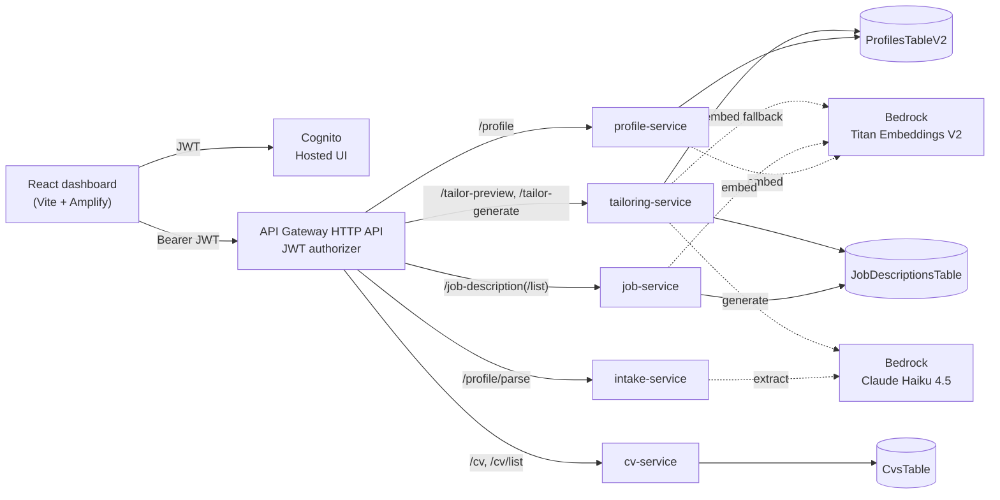

# AI-Powered Job Application Tailoring Platform

An AI-powered web app that helps job seekers produce a tailored CV for each role they apply to, grounded in their real experience.

You describe your background once, in plain prose. The app turns it into a structured profile. For each job posting you save, it picks out the parts of your history that are semantically relevant and has Claude write a tailored CV from only that real data. Claude is told not to invent employers, dates, or achievements. You then edit the CV in the browser, choose a template, and export it to PDF.

> **Docs map:** this README is the product overview.
> The current architecture and design decisions live in [`PLAN.md`](PLAN.md). Route-level reference is in [`API.md`](API.md), and what was actually run against real AWS is in [`TESTING.md`](TESTING.md).
> Forward-looking plans: [`PRODUCTION.md`](PRODUCTION.md), [`MONETISATION.md`](MONETISATION.md), [`VOICE_INTERVIEW.md`](VOICE_INTERVIEW.md).

---

## Problem

Applying for jobs is repetitive and time-consuming. Most candidates need to:

- rewrite the same experience for different roles
- adjust CVs to match job descriptions
- create new cover letters for each company
- keep track of which application version was sent where

This is especially painful for students, graduates, and early-career tech professionals applying to many roles at once.

## Solution

An AI career-document system that stores a candidate's experience as structured data. It matches that data against each job description by meaning, not just keywords, and generates role-specific application materials from what the candidate has actually done.

---

## How it works

1. **Sign in.** Cognito Hosted UI handles sign-in. Every API call carries a Cognito JWT.
2. **Describe yourself.** Paste your background as free text. `POST /profile/parse` uses Claude to extract it into structured skills, experience, projects, and education. You review and correct the result, then save it (`PUT /profile`).
3. **Embed on write.** Each project and experience entry is embedded once with Titan Text Embeddings V2 when it's saved, and the vector is cached. Unchanged entries are never re-embedded or rewritten.
4. **Save a job.** Paste a job posting (`PUT /job-description`). Its description is embedded once too.
5. **Tailor.** `POST /tailor-generate` ranks your entries by cosine similarity to the job, drops noise below a calibrated threshold (`0.10`), and keeps the top matches. It then sends those matches plus the raw job text to **Claude Haiku 4.5** on Bedrock, which returns a structured CV.
6. **Edit and export.** In the CV builder you can edit text in either the form or the A4 preview (the two stay in sync). You can switch between the Modern, Classic, and Embedded templates, check where page breaks fall, and export a multi-page PDF. CVs autosave to your account.

## Architecture

Serverless, defined in AWS CDK (`infra/`). It runs five Python Lambdas behind one API Gateway HTTP API, with every route behind a Cognito JWT authorizer. Storage is DynamoDB. There's no VPC and no RDS.


```mermaid
flowchart LR
  UI["React dashboard<br/>(Vite + Amplify)"] -->|JWT| Cognito["Cognito<br/>Hosted UI"]
  UI -->|"Bearer JWT"| API["API Gateway HTTP API<br/>JWT authorizer"]

  API -->|"/profile"| PS[profile-service]
  API -->|"/profile/parse"| IS[intake-service]
  API -->|"/job-description(/list)"| JS[job-service]
  API -->|"/tailor-preview, /tailor-generate"| TS[tailoring-service]
  API -->|"/cv, /cv/list"| CS[cv-service]

  PS --> PT[(ProfilesTableV2)]
  JS --> JT[(JobDescriptionsTable)]
  TS --> PT
  TS --> JT
  CS --> CT[(CvsTable)]

  PS -. embed .-> Titan["Bedrock<br/>Titan Embeddings V2"]
  JS -. embed .-> Titan
  TS -. embed fallback .-> Titan
  IS -. extract .-> Haiku["Bedrock<br/>Claude Haiku 4.5"]
  TS -. generate .-> Haiku
```

| Service | Routes | Storage | Bedrock |
|---|---|---|---|
| `profile-service` | `GET/PUT /profile` | `ProfilesTableV2` (one `PROFILE` item + one item per project/experience) | Titan embeddings |
| `intake-service` | `POST /profile/parse` | none (parse only, never saves) | Claude Haiku 4.5 |
| `job-service` | `GET/PUT /job-description`, `GET /job-description/list` | `JobDescriptionsTable` | Titan embeddings |
| `tailoring-service` | `POST /tailor-preview` (keyword-only, free), `POST /tailor-generate` | reads both tables above | Titan (fallback) + Claude Haiku 4.5 |
| `cv-service` | `PUT/GET/DELETE /cv`, `GET /cv/list` | `CvsTable` | none (CRUD only) |

All tables are partitioned by `user_id`, which is the verified Cognito `sub`. A user can only ever read their own partition. For the full rationale (why no RAG or S3, why DynamoDB rather than RDS, embedding-cache rules, threshold calibration), see [`PLAN.md`](PLAN.md).

### Tech stack

- **Backend:** AWS CDK (TypeScript), AWS Lambda (Python 3.12), API Gateway HTTP API, DynamoDB, Cognito, Amazon Bedrock (Claude Haiku 4.5 via the Converse API, Titan Text Embeddings V2)
- **Frontend:** React 18, TypeScript, Vite, Tailwind CSS, Zustand + immer, AWS Amplify (auth), html2canvas + jsPDF (export), Vitest

### Repo layout

```
infra/                CDK app (infra/lib/infra-stack.ts) + Lambda sources
  lambda/profile-service/
  lambda/intake-service/
  lambda/job-service/
  lambda/tailoring-service/
  lambda/cv-service/
dashboard/            React + Vite frontend
  src/pages/          Login, AuthCallback, ProfileIntake (/profile), JobDescription (/jobs), CVBuilder (/builder)
  src/api/backend.ts  typed client for every route
  src/components/     CV templates, PaginatedCV, editable fields
docs/superpowers/     design specs and implementation plans
postman/              Postman collection for the API
Image/                architecture diagrams from the original (RDS-era) design
```

## Running it

**Prerequisites:** an AWS account with Bedrock model access enabled in `us-east-1` for both Claude Haiku 4.5 and Titan Text Embeddings V2. You'll also need Node.js and the AWS CDK CLI.

```bash
# Deploy the backend
cd infra
npm install
npx cdk deploy        # outputs the API URL and Cognito UserPool/Client/Domain

# Run the dashboard
cd ../dashboard
npm install
# dashboard/.env.local — values from the cdk deploy outputs
#   VITE_API_URL=<api url>
#   VITE_COGNITO_USER_POOL_ID=<UserPoolId>
#   VITE_COGNITO_CLIENT_ID=<UserPoolClientId>
#   VITE_COGNITO_DOMAIN=<UserPoolDomain>
npm run dev           # http://localhost:5173 (the Cognito callback URL)
npm test              # Vitest unit tests (no server needed)
```

## Status

**Built and verified against real AWS:**
- Cognito authentication, with identity taken from the JWT `sub`
- Free-text profile intake
- The multi-item `ProfilesTableV2` schema
- Saving and editing job descriptions
- Semantic matching with a calibrated threshold
- CV generation with Claude Haiku 4.5
- Bedrock cost logging (about $0.002–$0.008 per new user)

**Built, with verification still pending:**
- CV persistence (`cv-service` + autosave)
- Multi-page A4 pagination and PDF export
- Two-way editable CV text

**Next up:**
- Delete for saved jobs
- Profile edits that merge rather than overwrite
- ATS-friendly text-based PDF export
- Cover letter generation
- A voice interview agent

The authoritative, up-to-date tracker is [`PLAN.md`](PLAN.md).
