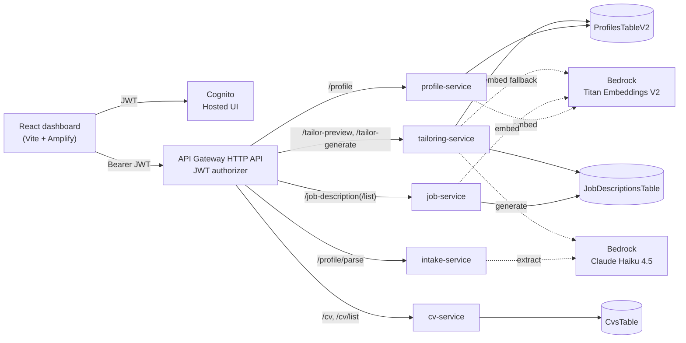
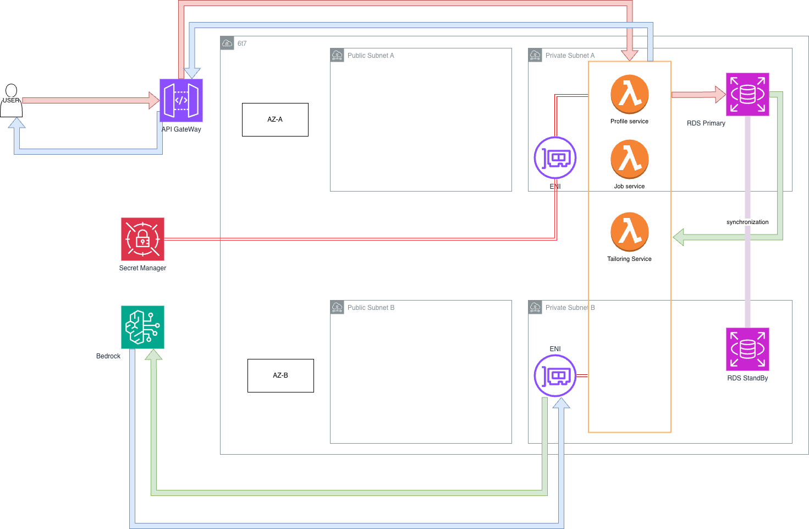
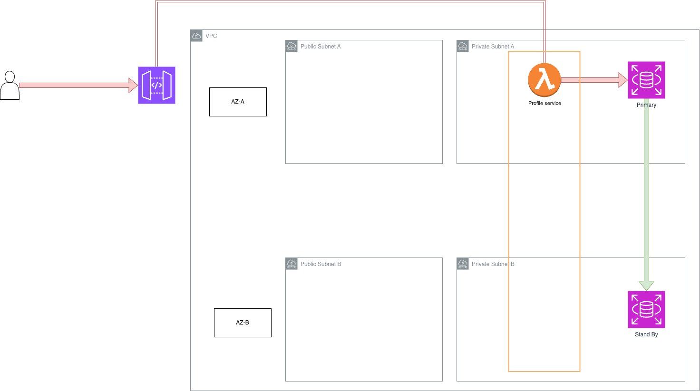
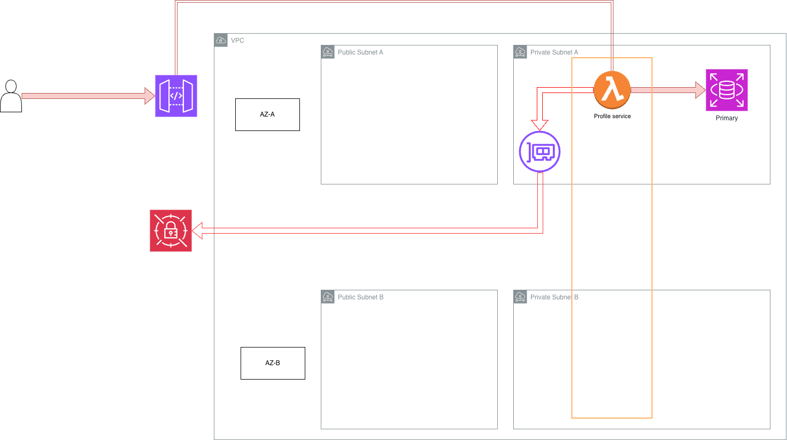

# AI-Powered Job Application Tailoring Platform

An AI-powered web app that helps job seekers produce a tailored CV for each role they apply to, grounded in their real experience.

You describe your background once, in plain prose. The app turns it into a structured profile. For each job posting you save, it picks out the parts of your history that are semantically relevant and has Claude write a tailored CV from only that real data. Claude is told not to invent employers, dates, or achievements. You then edit the CV in the browser, choose a template, and export it to PDF.

> **Docs map:** this README covers the product overview plus a retrospective **build log**.
> The current architecture and design decisions live in [`PLAN.md`](PLAN.md). Route-level reference is in [`API.md`](API.md), and what was actually run against real AWS is in [`TESTING.md`](TESTING.md).
> Forward-looking plans: [`PRODUCTION.md`](PRODUCTION.md), [`MONETISATION.md`](MONETISATION.md), [`VOICE_INTERVIEW.md`](VOICE_INTERVIEW.md).

---

## Problem

Applying for jobs is repetitive and time-consuming. Most candidates need to:

- rewrite the same experience for different roles
- adjust CVs to match job descriptions
- create new cover letters for each company
- keep track of which application version was sent where

This is especially painful for students, graduates, and early-career tech professionals applying to many roles at once.

## Solution

An AI career-document system that stores a candidate's experience as structured data. It matches that data against each job description by meaning, not just keywords, and generates role-specific application materials from what the candidate has actually done.

---

## How it works

1. **Sign in.** Cognito Hosted UI handles sign-in. Every API call carries a Cognito JWT.
2. **Describe yourself.** Paste your background as free text. `POST /profile/parse` uses Claude to extract it into structured skills, experience, projects, and education. You review and correct the result, then save it (`PUT /profile`).
3. **Embed on write.** Each project and experience entry is embedded once with Titan Text Embeddings V2 when it's saved, and the vector is cached. Unchanged entries are never re-embedded or rewritten.
4. **Save a job.** Paste a job posting (`PUT /job-description`). Its description is embedded once too.
5. **Tailor.** `POST /tailor-generate` ranks your entries by cosine similarity to the job, drops noise below a calibrated threshold (`0.10`), and keeps the top matches. It then sends those matches plus the raw job text to **Claude Haiku 4.5** on Bedrock, which returns a structured CV.
6. **Edit and export.** In the CV builder you can edit text in either the form or the A4 preview (the two stay in sync). You can switch between the Modern, Classic, and Embedded templates, check where page breaks fall, and export a multi-page PDF. CVs autosave to your account.

## Architecture

Serverless, defined in AWS CDK (`infra/`). It runs five Python Lambdas behind one API Gateway HTTP API, with every route behind a Cognito JWT authorizer. Storage is DynamoDB. There's no VPC and no RDS.


```mermaid
flowchart LR
  UI["React dashboard<br/>(Vite + Amplify)"] -->|JWT| Cognito["Cognito<br/>Hosted UI"]
  UI -->|"Bearer JWT"| API["API Gateway HTTP API<br/>JWT authorizer"]

  API -->|"/profile"| PS[profile-service]
  API -->|"/profile/parse"| IS[intake-service]
  API -->|"/job-description(/list)"| JS[job-service]
  API -->|"/tailor-preview, /tailor-generate"| TS[tailoring-service]
  API -->|"/cv, /cv/list"| CS[cv-service]

  PS --> PT[(ProfilesTableV2)]
  JS --> JT[(JobDescriptionsTable)]
  TS --> PT
  TS --> JT
  CS --> CT[(CvsTable)]

  PS -. embed .-> Titan["Bedrock<br/>Titan Embeddings V2"]
  JS -. embed .-> Titan
  TS -. embed fallback .-> Titan
  IS -. extract .-> Haiku["Bedrock<br/>Claude Haiku 4.5"]
  TS -. generate .-> Haiku
```

| Service | Routes | Storage | Bedrock |
|---|---|---|---|
| `profile-service` | `GET/PUT /profile` | `ProfilesTableV2` (one `PROFILE` item + one item per project/experience) | Titan embeddings |
| `intake-service` | `POST /profile/parse` | none (parse only, never saves) | Claude Haiku 4.5 |
| `job-service` | `GET/PUT /job-description`, `GET /job-description/list` | `JobDescriptionsTable` | Titan embeddings |
| `tailoring-service` | `POST /tailor-preview` (keyword-only, free), `POST /tailor-generate` | reads both tables above | Titan (fallback) + Claude Haiku 4.5 |
| `cv-service` | `PUT/GET/DELETE /cv`, `GET /cv/list` | `CvsTable` | none (CRUD only) |

All tables are partitioned by `user_id`, which is the verified Cognito `sub`. A user can only ever read their own partition. For the full rationale (why no RAG or S3, why DynamoDB rather than RDS, embedding-cache rules, threshold calibration), see [`PLAN.md`](PLAN.md).

### Tech stack

- **Backend:** AWS CDK (TypeScript), AWS Lambda (Python 3.12), API Gateway HTTP API, DynamoDB, Cognito, Amazon Bedrock (Claude Haiku 4.5 via the Converse API, Titan Text Embeddings V2)
- **Frontend:** React 18, TypeScript, Vite, Tailwind CSS, Zustand + immer, AWS Amplify (auth), html2canvas + jsPDF (export), Vitest

### Repo layout

```
infra/                CDK app (infra/lib/infra-stack.ts) + Lambda sources
  lambda/profile-service/
  lambda/intake-service/
  lambda/job-service/
  lambda/tailoring-service/
  lambda/cv-service/
dashboard/            React + Vite frontend
  src/pages/          Login, AuthCallback, ProfileIntake (/profile), JobDescription (/jobs), CVBuilder (/builder)
  src/api/backend.ts  typed client for every route
  src/components/     CV templates, PaginatedCV, editable fields
docs/superpowers/     design specs and implementation plans
postman/              Postman collection for the API
Image/                architecture diagrams from the original (RDS-era) design
```

## Running it

**Prerequisites:** an AWS account with Bedrock model access enabled in `us-east-1` for both Claude Haiku 4.5 and Titan Text Embeddings V2. You'll also need Node.js and the AWS CDK CLI.

```bash
# Deploy the backend
cd infra
npm install
npx cdk deploy        # outputs the API URL and Cognito UserPool/Client/Domain

# Run the dashboard
cd ../dashboard
npm install
# dashboard/.env.local — values from the cdk deploy outputs
#   VITE_API_URL=<api url>
#   VITE_COGNITO_USER_POOL_ID=<UserPoolId>
#   VITE_COGNITO_CLIENT_ID=<UserPoolClientId>
#   VITE_COGNITO_DOMAIN=<UserPoolDomain>
npm run dev           # http://localhost:5173 (the Cognito callback URL)
npm test              # Vitest unit tests (no server needed)
```

## Status

**Built and verified against real AWS:**
- Cognito authentication, with identity taken from the JWT `sub`
- Free-text profile intake
- The multi-item `ProfilesTableV2` schema
- Saving and editing job descriptions
- Semantic matching with a calibrated threshold
- CV generation with Claude Haiku 4.5
- Bedrock cost logging (about $0.002–$0.008 per new user)

**Built, with verification still pending:**
- CV persistence (`cv-service` + autosave)
- Multi-page A4 pagination and PDF export
- Two-way editable CV text

**Next up:**
- Delete for saved jobs
- Profile edits that merge rather than overwrite
- ATS-friendly text-based PDF export
- Cover letter generation
- A voice interview agent

The authoritative, up-to-date tracker is [`PLAN.md`](PLAN.md).

---

# Build log

A retrospective of how the project got here, step by step. The early steps describe the **original RDS-based design**, which was later replaced (see Phase 3). They're kept as a record and don't describe the current architecture.

## Phase 1: MVP backend (original RDS design, superseded)

The original plan used two Lambdas: a profile service that read and wrote RDS, and a tailoring Lambda that pulled the profile, called Bedrock, and returned a CV and cover letter.



1. Profile service Lambda
   1. Create user profile
   2. update profile
   3. Read and write to RDS
2. Job tailoring Lambda
   1. receive job description
   2. fetch user profile form DB
   3. call Bedrock
   4. CV/Cover letter generate
   5. return result

#### Step-1: Fundation setup with CDK
Use CDK to create apigateway and lambda LaC then test it

- remember dont delete the S3 bucket made form the bootstrap otherwise u need to delete the CDKToolkit stack and bootstrap again

```
> curl -X PUT "https://kbmowaael3.execute-api.us-east-1.amazonaws.com/profile"
{"message": "Profile service API is running"}%  
```
this show that the apigateway and lambda is successfully running!

- i have done some update for the stack code, so now the lambda code is not use 
Code.formInline but Code.fromAsset, and it turn out that the cloudformation will put the lambda in the zip and in a default bucket

```
ProfileServiceHandler4430D52F:
    Type: AWS::Lambda::Function
    Properties:
      Code:
        S3Bucket:
          Fn::Sub: cdk-hnb659fds-assets-${AWS::AccountId}-${AWS::Region}
        S3Key: d0ec76d1f190c9fdca3600e82a628d9b7eabbee7ca98041fa28f10fe43b79ddb.zip
      Handler: index.handler
```
- alright i make the lambda took json data and echo back

```
curl -X PUT "https://kbmowaael3.execute-api.us-east-1.amazonaws.com/profile" \
  -H "Content-Type: application/json" \
  -d '{
    "full_name": "Allan Chien",
    "email": "allan@example.com",
    "skills": ["AWS", "Python", "Docker"],
    "projects": [
      {
        "name": "Stock Market Real-Time Data Analytics Pipeline on AWS"
      }
    ]
  }'
{"message": "Profile received successfully", "received_profile": {"full_name": "Allan Chien", "email": "allan@example.com", "skills": ["AWS", "Python", "Docker"], "projects": [{"name": "Stock Market Real-Time Data Analytics Pipeline on AWS"}]}}%   
```
#### Step-2: RDS implement


Implement the architecture using CDK
##### 2.1: Implemment lambda profile service backend logic

 Now the Python code should move from echo test handler to real profile-service backend logic.

- remember to install necessary package for example 
```
import psycopg
```
with 
```
cd infra/lambda/profile-service
pip install --target . 'psycopg[binary]'
```

this is because  AWS Lambda does not come with psycopg preinstalled.

- okay lambda funcion erro form cloudwatch log, this is probally issue with psycopg
```
[ERROR] Runtime.ImportModuleError: Unable to import module 'index': no pq wrapper available.
Attempts made:
- couldn't import psycopg 'c' implementation: No module named 'psycopg_c'
- couldn't import psycopg 'binary' implementation: cannot import name 'pq' from 'psycopg_binary' (/var/task/psycopg_binary/__init__.py)
- couldn't import psycopg 'python' implementation: libpq library not found
Traceback (most recent call last):
```
need to fix it

now I have try 
```
import pg8000
```
but I think the problem is Lambda cannot reach Secrets Manager from the isolated subnet, so i probally need a redesign of the architecture



so use an enterface endpoint to connect the instances in the private subnet to the public aws service

```
> curl -X PUT "https://kbmowaael3.execute-api.us-east-1.amazonaws.com/profile" \
  -H "Content-Type: application/json" \
  -d '{
    "full_name": "Allan Chien",
    "email": "allan@example.com",
    "skills": ["AWS", "Python", "Docker"]
  }'

{"message": "Profile saved successfully", "profile_id": 1, "email": "allan@example.com"}%                                                                             
```
ok now the implemntion is good
Now i need to find a way to connet to the RDS to verify data table 
so i have sucessfully add a GET endpoint and verify data in RDS
```
> curl "https://kbmowaael3.execute-api.us-east-1.amazonaws.com/profile?email=allan@example.com"
{"profile_id": 1, "email": "allan@example.com", "full_name": "Allan Chien", "profile_data": {"email": "allan@example.com", "skills": ["AWS", "Python", "Docker"], "full_name": "Allan Chien"}}%                                 
```

##### 2.2: Add job description endpoint
```
> curl -X PUT "https://kbmowaael3.execute-api.us-east-1.amazonaws.com/job-description" \
  -H "Content-Type: application/json" \
  -d '{
    "company_name": "Catalyst Cloud",
    "job_title": "Junior DevOps Engineer",
    "raw_description": "We are looking for someone with AWS, Linux, CI/CD..."
  }'
{"message": "Job description saved successfully", "job_id": 1, "company_name": "Catalyst Cloud", "job_title": "Junior DevOps Engineer"}%   

 curl "https://kbmowaael3.execute-api.us-east-1.amazonaws.com/job-description?job_id=1"
{"job_id": 1, "company_name": "Catalyst Cloud", "job_title": "Junior DevOps Engineer", "raw_description": "We are looking for someone with AWS, Linux, CI/CD..."}%     
```

#### Step-3: AI service implemet 
##### 3.1: Add tailoring Lambda
1. get email and job_id
2. read profile row
3. read job description row
4. extract requirements from raw_description
5. score profile skills/projects
6. return matched context

```
curl -X POST "https://kbmowaael3.execute-api.us-east-1.amazonaws.com/tailor-preview" \
  -H "Content-Type: application/json" \
  -d '{
    "email": "allan@example.com",
    "job_id": 1
  }'
{"message": "Tailor preview data loaded successfully", "email": "allan@example.com", "job_id": 1, "profile": {"profile_id": 1, "email": "allan@example.com", "full_name": "Allan Chien", "profile_data": {"email": "allan@example.com", "skills": ["AWS", "Python", "Docker"], "full_name": "Allan Chien"}}, "job_description": {"job_id": 1, "company_name": "Catalyst Cloud", "job_title": "Junior DevOps Engineer", "raw_description": "We are looking for someone with AWS, Linux, CI/CD..."}, "extracted_requirements": ["aws", "linux", "ci/cd"]}%                                                                                                
```
now i need ot do 5. and 6.

```
 curl -X POST "https://kbmowaael3.execute-api.us-east-1.amazonaws.com/tailor-preview" \
  -H "Content-Type: application/json" \
  -d '{
    "email": "allan@example.com",
    "job_id": 1
  }'
{"message": "Tailor preview data loaded successfully", "email": "allan@example.com", "job_id": 1, "profile": {"profile_id": 1, "email": "allan@example.com", "full_name": "Allan Chien", "profile_data": {"email": "allan@example.com", "skills": ["AWS", "Python", "Docker"], "projects": [{"name": "2048 CI/CD Project", "description": "Built a CI/CD pipeline using AWS CodePipeline, ECS, and ECR."}], "full_name": "Allan Chien", "experience": [{"title": "Research Engineer", "description": "Worked on Bittide protocol implementation."}]}}, "job_description": {"job_id": 1, "company_name": "Catalyst Cloud", "job_title": "Junior DevOps Engineer", "raw_description": "We are looking for someone with AWS, Linux, CI/CD..."}, "extracted_requirements": ["aws", "linux", "ci/cd"], "matched_skills": ["aws"], "matched_projects": [{"name": "2048 CI/CD Project", "description": "Built a CI/CD pipeline using AWS CodePipeline, ECS, and ECR.", "score": 10, "matched_terms": ["ci/cd", "aws"]}], "matched_experiences": [], "prompt_context": {"candidate": {"full_name": "Allan Chien", "email": "allan@example.com"}, "target_role": {"company_name": "Catalyst Cloud", "job_title": "Junior DevOps Engineer"}, "job_requirements": ["aws", "linux", "ci/cd"], "matched_skills": ["aws"], "matched_projects": [{"name": "2048 CI/CD Project", "description": "Built a CI/CD pipeline using AWS CodePipeline, ECS, and ECR.", "score": 10, "matched_terms": ["ci/cd", "aws"]}], "matched_experiences": []}}%                
```

---

## Phase 2: Dashboard + first CV service (RDS-era)

Phase 2 shifted focus from backend services to a real frontend, plus a persistence layer for the documents the frontend creates.

#### Step-4: CV Dashboard (React + Vite)

Built a `dashboard/` app (React, TypeScript, Vite) on a separate `PDF-Dashboard` branch, in parallel with the Step-3 tailoring work on `main`:

- `LoginPage`, `MyCVsPage`, `CVBuilderPage` — pages for signing in, listing saved CVs, and editing one
- `CVEditor` + `ModernTemplate` — structured CV editing with a rendered preview template
- `exportPDF` util — client-side export of the rendered CV to PDF
- `useCVStore` — app state (Zustand-style store) shared across the builder
- `AISidebar` — panel of AI tool cards (job alignment, readability, ATS check, cover letter draft, etc.); currently UI-only placeholders ("Coming soon") not yet wired to the tailoring-service or Bedrock

#### Step-5: CV persistence service

Added a fourth Lambda, `cv-service`, so the dashboard has somewhere to save/load CVs:

- `PUT /cv` — create or update a CV (`cv_data` stored as `JSONB`, keyed by `email`)
- `GET /cv` — fetch one CV by `cv_id` + `email`
- `GET /cv/list` — list a user's non-archived CVs, most recently updated first
- `DELETE /cv` — soft-delete (`is_archived = TRUE`) rather than hard delete

Same RDS instance and Secrets Manager access pattern as `profile-service`.

#### Step-6: Merge frontend and backend

- Wired the dashboard's `api/cvApi.ts` calls to the deployed `cv-service` endpoints and cleaned out files that had been accidentally committed
- Merged `PDF-Dashboard` into `main` (PR #1), bringing the dashboard and all four backend services (`profile-service`, `job-service`, `tailoring-service`, `cv-service`) together for the first time

> At the end of Phase 2, the dashboard's AI tools were placeholders, matching was exact-keyword against a hardcoded skill list, and no Bedrock text had been generated yet. Phase 3 addressed all three, and the redesign replaced most of the Phase 1 backend.

---

## Phase 3: Redesign (DynamoDB, semantic matching, Bedrock generation, auth)

Full design rationale for every step below is in [`PLAN.md`](PLAN.md), and real-AWS test runs are in [`TESTING.md`](TESTING.md).

#### Step-7: Drop RDS and the VPC, move to DynamoDB

`profiles` and `job_descriptions` turned out to be single-item JSON blobs with no relational joins anywhere, which is a DynamoDB shape. Moving them to DynamoDB tables meant no Lambda needed RDS anymore. That removed the VPC, the security groups, the Secrets Manager interface endpoint, and the psycopg/pg8000 packaging pain from Step 2. `job_id` became a UUID rather than a SERIAL int. Each Lambda was deployed in stages: it went to real AWS only after it passed code review.

#### Step-8: Semantic matching with cached embeddings

The tailoring service changed from keyword overlap to **embedding similarity**. Now a job description that asks for "CI/CD pipelines" can match a profile line about an "automated deployment workflow".

- Each project and experience entry is embedded once on save with Titan Text Embeddings V2, and the vector is cached on the entry. An entry is re-embedded only when its text actually changes. Entries are matched by name or title, not by array position.
- `/tailor-generate` ranks entries purely by cosine similarity. Anything below `MIN_SEMANTIC_SCORE = 0.10` is dropped, and the top 3 matches go into the prompt. The threshold was calibrated on two real test profiles, one of them an adversarial hobby written to sound technical.
- `skills` and `education` are deliberately not matched. They pass through to the CV as they are.
- `/tailor-preview` keeps the old free, keyword-only path.

#### Step-9: Bedrock CV generation

`POST /tailor-generate` sends the matched entries plus the **raw job description text** to Claude Haiku 4.5 through the Converse API and gets a structured CV back. Testing against real Bedrock surfaced several problems, each fixed and then re-verified:

- the model invented an employer by using the target company's name, so `company` was added to the experience schema and the prompt was tightened
- matched projects were silently dropped from the output
- education coursework was missing
- an expired card on the account blocked Bedrock Marketplace access

A `BEDROCK_USAGE` log line on every call puts the measured cost of a new user at about **$0.002–$0.008**.

#### Step-10: Free-text profile intake

A fifth Lambda, `intake-service` (`POST /profile/parse`), uses one Claude call to turn a pasted paragraph about your background into the structured profile schema. It parses but never saves, so the user reviews the result before calling `PUT /profile`. That review step is the main defence against extraction hallucination. `education` and per-entry `period` fields were added across every layer at the same time.

#### Step-11: Cognito authentication

Before this step, any route would accept any `email`. Now every route sits behind an API Gateway JWT authorizer, the dashboard signs in through the Cognito Hosted UI, and every Lambda gets the user's identity only from the token's `sub` claim. Table partition keys changed from `email` to `user_id`. Two real users were checked against each other to confirm neither could see the other's data. A lesson from this step: the `aws.cognito.signin.user.admin` scope has to be *allowed* in CDK **and** *requested* by the frontend.

#### Step-12: The real dashboard flow

The placeholder pages were replaced with a working end-to-end flow:

- `/profile` covers paste, parse, edit, and save.
- `/jobs` covers saving and editing jobs and generating or regenerating a tailored CV.
- `/builder` covers editing and export:
  - three templates: Modern, Classic, and Embedded
  - two-way editing, where changes in the form or in the A4 preview update the other
  - optional skill levels
  - client-side A4 pagination, so the preview shows real page breaks and the PDF export matches it page for page

#### Step-13: Profile multi-item schema (`ProfilesTableV2`)

With an embedding on every entry, a single-item profile grew with the user's whole history and could approach DynamoDB's item size limit. The new `ProfilesTableV2` stores one `PROFILE` item plus one `PROJECT#<id>` or `EXPERIENCE#<id>` item per entry. Each item stays small, and a save rewrites only the entries that changed. This was verified on real AWS: re-saving with only the name changed left every project item byte-for-byte identical.

#### Step-14: CV persistence, again

A new `cv-service` backed by DynamoDB (`CvsTable`) stores the dashboard's CVs per user, with no Bedrock calls. The dashboard autosaves through a local write-through buffer, using a debounce, retries, and a flush when the tab is hidden. Deployment verification is still pending.

### Where it stands now

See **Status** at the top of this README, and [`PLAN.md`](PLAN.md) for the live tracker.
